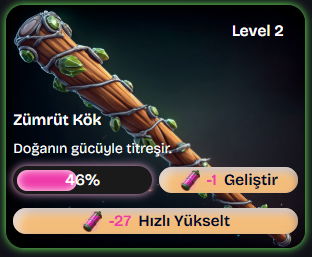
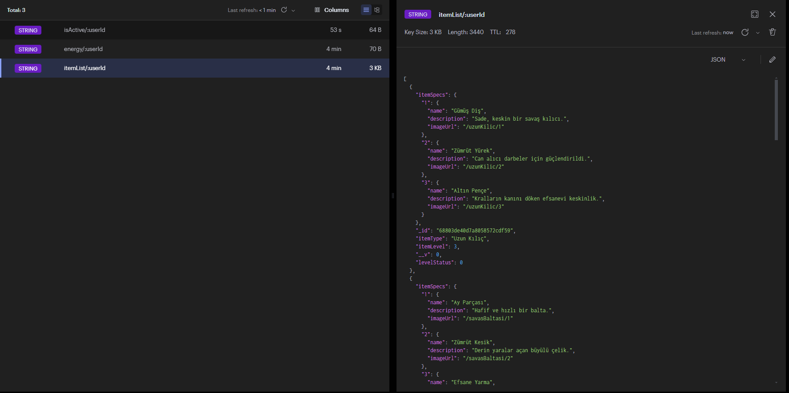
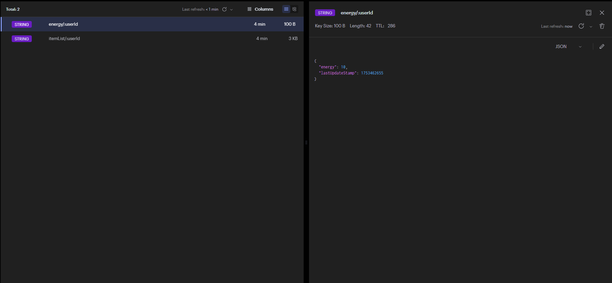
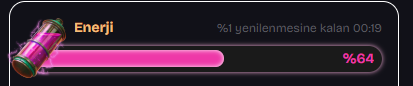
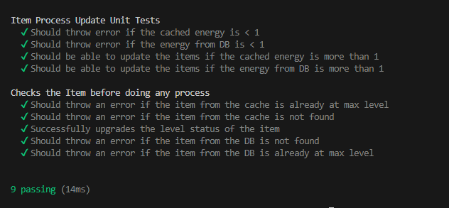
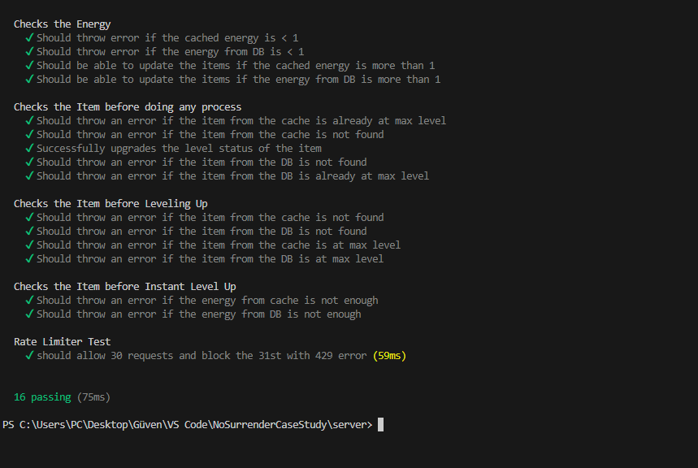
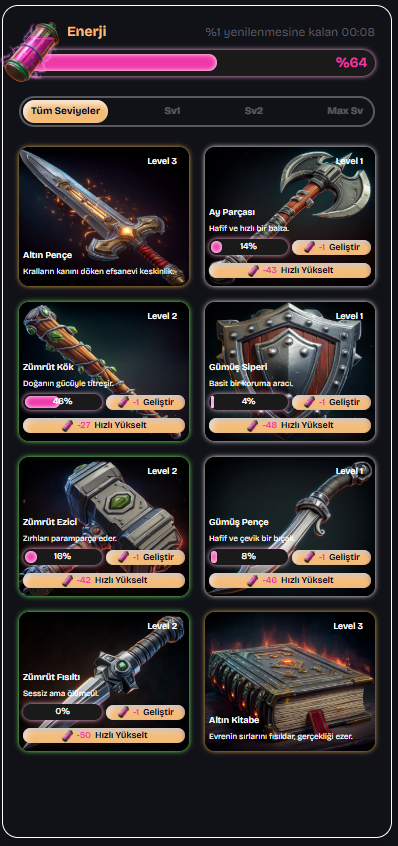

# ⚔️ No Surrender - Case Study  
**Full-Stack Developer Technical Task Solution**  
**July 2025**

---
# 📁  Project Structure 
```bash
├── client/         # Next.js Frontend
│   └── public/     # Static assets (icons, images)
│   └── readmeImages/  # Images for documentation
├── server/         # Node.js Backend (Express)
```
## 🧑‍💻 Note from the Developer

In this project, I personally focused mostly on **caching**, **performance optimization**, and **preventing data loss**.

In a real-world production environment, an **event-driven architecture** could have been more scalable and robust for this kind of system.  
However, I intentionally avoided overengineering for the scope of this case study and chose to focus on **cache-driven optimization** and **backend reliability** instead.

> **Also:** If hosting had been required as part of the project, I would have uploaded static assets and images to a **cloud storage service** (such as Supabase or similar) to enhance performance and scalability.  
But since I was told that running the app locally and providing a repository would be sufficient, I kept those files in the **public folder** on the client side.

> **And one more note:** Since there is no authentication system implemented in this case study, I didn’t have a real userId to work with.
For simulation purposes, I used a general userId tag throughout the code.
In a real production environment, this would be dynamically replaced with the authenticated user’s unique identifier.

> **One Final Note:** I built the routes in two different rount and did not use the /api root, because in the e-mail i had it says, if i could came up with different design, i can do it.  

---

## 🧩 Task Summary

This project was developed to make card upgrades **faster**, **smoother**, and **more secure** for players.  
Backed by **Redis caching**, a **debounce queue mechanism**, and a simple yet effective UI.

---

## 🎯 Objective

Players try to upgrade their cards using **limited energy**.  
Each click consumes energy and increases the card progress by **2%**.  
However, this process was slow and weak in terms of UX.

> ✅ **My goal:**  
Make the process faster and more engaging, while ensuring backend **performance** and **data safety**.

---

## 🧠 User Experience Improvements

> _“Why should a user click 50 times to level up?”_

- Added a **“Quick Upgrade”** button (appears if the user has enough energy)
- With one click, the card gets updated one more level
- **Toast message** provide instant feedback
- Applied **debounce logic** on the UI to prevent spamming

📸 _Example Screenshot_  


---

## ⚡ Performance Optimizations

> _“Sending a request on every click? That’s inefficient.”_

- Developed a **Request Queue + Debounce Cache** mechanism
- If the user clicks again within 2 seconds, the **new request overrides** the previous
- Only the **latest state is persisted** to the database
- Energy checks are done via **Redis backend cache**

📸 _Request Lifecycle_  


---

## 🛡️ Security Measures

> _“Modifying energy on client? Not effective anymore.”_

- **Strict backend validation** based on `userId`
- Redis is used as a **consistency layer** before DB write
- **Rate limiting** via `express-rate-limit` protects endpoints

📸 _Validation Flow_  


---

## 🧷 Data Consistency

> _“No more risk of losing data.”_

Two Redis patterns implemented:

- 🧊 **Cache-aside pattern** → For `energy` (refreshed every 2 mins)
- 🔁 **Debounce pattern** → For progress/level-up requests

✔️ All visible values on the frontend are reflected accurately to the backend  
✔️ Critical actions wrapped in `try/catch` and safe fallbacks

📸 _Energy_  


---

## ⚙️ Tech Stack

- **Backend**: Node.js, Express, MongoDB, Mongoose  
- **Caching**: Redis (cache-aside + debounce pattern)  
- **Security**: express-rate-limit  
- **Frontend**: Next.js 15, TailwindCSS 4, Shadcn UI, React 19  

---

## 🧪 Tests & Edge Case Scenarios

- 🔁 **Double-clicks** → Debounced to a single request  
- ⚠️ **Low energy** → Validated securely on backend  
- ❗ **Mismatch between energy/progress** → Prevented with Redis+DB sync  
- 🚫 **API abuse** → Blocked via rate-limiting  
- 🔄 **Redis fallback** → DB fetch used if Redis fails

---

## ✅ Test Coverage & Code Quality

To ensure backend reliability and performance under edge conditions, I implemented a focused test suite using:

- 🧪 **Mocha** – Test runner  
- 🔍 **Chai** – Assertions  
- 🧰 **Sinon** – Mocks for Redis and DB  
- 🌐 **Supertest** – API endpoint testing and rate-limit validation  

### 🔬 Key Scenarios Covered

| Area                        | Tested? |
|----------------------------|---------|
| Energy validation (cache)  | ✅      |
| Fallback to DB             | ✅      |
| Max-level item protection  | ✅      |
| API Rate Limiting          | ✅      |

---

### 🧪 Sample Test Cases

- Throws `"Yeterli enerjin yok!"` when energy in Redis is insufficient  
- Simulates **30+ requests in 2 seconds** to verify rate-limiting  
- Checks that max-level items cannot be leveled up  
- Validates successful fallback when Redis returns null  
- Ensures that latest item progress is written (not intermediate ones)

📸 _Test Snapshots_  
  


### 🧠 Test Insights

- Each function tested with **mocked external dependencies** (Redis, MongoDB)  
- Test assertions go beyond status codes — they **verify error messages and side-effects**  
- Used **Sinon timers** to simulate time-based logic (debounce/rate-limit)

### 🚀 Run Tests

```bash
cd server
npm run test
```
## 💡 Result

With this solution:

- Players can **level up with one click**
- API traffic **reduced by ~90%**
- Improved **UX**, **performance**, and **data integrity**

📸 _Final App Preview_  


---

```bash
# CLIENT SETUP
cd client
npm install
npm run dev

# SERVER SETUP
cd server
npm install
npm run dev
```

> _Thank you for reading_  
